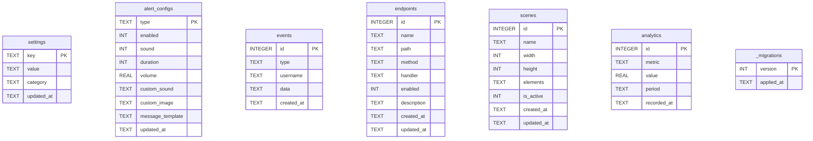

# Worxed Stream Manager - Architecture

## System Overview

Worxed Stream Manager is a full-stack streaming management platform with four main layers: a process supervisor, a shared SQLite database, a backend API server, and a React-based stream manager frontend with OBS overlay support.


---

## Port Reference

| Port | Service | Technology | Purpose |
|------|---------|------------|---------|
| **4000** | Supervisor + Admin | Node.js + ws | Process management, admin UI host, API proxy |
| **4001** | Backend | Express + Socket.IO | API server, Twitch integration |
| **4002** | Admin Dev | Vite | Admin console development only |
| **5173** | Frontend | Vite | Stream manager (React) + OBS overlays |

---

## Tech Stack

### Supervisor

| Technology | Purpose |
|------------|---------|
| **Node.js** | Runtime |
| **ws** | WebSocket server for log streaming |
| **better-sqlite3** | Database initialization and status |
| **child_process** | Spawn and manage backend/frontend |

### Shared Database

| Technology | Version | Purpose |
|------------|---------|---------|
| **better-sqlite3** | 12.6 | SQLite bindings (WAL mode) |
| **SQLite** | 3.51 | Persistent storage |

### Backend

| Technology | Version | Purpose |
|------------|---------|---------|
| **Node.js** | 20+ | Runtime |
| **Express** | 4.21 | HTTP server |
| **Socket.IO** | 4.8 | WebSocket server |
| **tmi.js** | 1.8 | Twitch IRC chat |
| **node-fetch** | 2.7 | Twitch API requests (CommonJS) |

### Admin Console (Vue)

| Technology | Version | Purpose |
|------------|---------|---------|
| **Vue** | 3.5 | UI framework |
| **Naive UI** | 2.40 | Component library |
| **Vite** | 7.3 | Build tool |
| **Tabler Icons** | 3.30 | Icon system |

### Frontend (React)

| Technology | Version | Purpose |
|------------|---------|---------|
| **React** | 19.2 | UI framework |
| **TypeScript** | 5.8 | Type safety |
| **Vite** | 7.3 | Build tool |
| **PrimeReact** | 10.x | Component library (unstyled/passthrough) |
| **react-konva** | 19.2 | Canvas-based scene editor |
| **Zustand** | 5.0 | State management (editor store) |
| **Socket.IO Client** | 4.8 | WebSocket client |
| **Lucide React** | 0.563 | Icon system |

> **Note:** Tailwind CSS was removed in v1.1. All styling uses hand-written utility CSS classes (same names as Tailwind) in `index.css` + a PrimeReact CSS bridge.

---

## Project Structure

```
worxed-stream-manager/
├── supervisor.js                 # Entry point - process manager
│
├── shared/                       # Database layer (used by supervisor + backend)
│   ├── database.js               # Singleton connection, WAL mode, pragmas
│   ├── schema.js                 # Table definitions + migration data
│   ├── migrations.js             # Version-based migration runner
│   └── index.js                  # Query helpers (settings, alerts, events, analytics, endpoints, scenes)
│
├── data/
│   └── worxed.db                 # SQLite database (auto-created)
│
├── backend/
│   ├── server.js                 # Express + Socket.IO server + Endpoint Builder + Scene API
│   ├── admin/                    # Vue admin console source
│   │   ├── src/
│   │   │   ├── App.vue           # Main admin layout
│   │   │   ├── main.js           # Vue entry point
│   │   │   └── components/
│   │   │       ├── LiveTerminal.vue      # Real-time log viewer
│   │   │       ├── ProcessManager.vue    # Start/stop controls
│   │   │       ├── StatusCard.vue        # Metric display
│   │   │       ├── LogViewer.vue         # Log filtering
│   │   │       ├── DatabaseStatus.vue    # DB health + table stats
│   │   │       ├── ConfigManager.vue     # Settings CRUD
│   │   │       ├── EventViewer.vue       # Event history browser
│   │   │       ├── EndpointBuilder.vue   # Custom endpoint creator
│   │   │       ├── JsonDesigner.vue      # JSON payload editor
│   │   │       ├── JsonNode.vue          # JSON tree node
│   │   │       └── SettingsManager.vue   # Category-based settings UI
│   │   ├── vite.config.js        # Builds to ../public
│   │   └── package.json
│   ├── public/                   # Built admin UI (served by supervisor at :4000)
│   │   ├── index.html
│   │   └── assets/
│   ├── .env                      # Environment variables
│   └── package.json
│
├── frontend/
│   ├── src/
│   │   ├── App.tsx               # Root: /overlay routing + AppMain shell
│   │   ├── main.tsx              # React entry point
│   │   ├── index.css             # Global styles, utility CSS, CSS variables, PrimeReact bridge
│   │   ├── components/
│   │   │   ├── Dashboard.tsx          # Stream stats, chat, activity, EventFeed
│   │   │   ├── Alerts.tsx             # Alert configuration
│   │   │   ├── Customizer.tsx         # Scene editor shell
│   │   │   ├── BackendDashboard.tsx   # System monitoring
│   │   │   ├── ThemeSwitcher.tsx      # Theme/mode picker (PrimeReact OverlayPanel)
│   │   │   ├── EventFeed.tsx          # Live custom endpoint event feed
│   │   │   ├── Overlay.tsx            # OBS scene-based overlay renderer
│   │   │   ├── ColorPicker.tsx        # Color picker component
│   │   │   ├── common/
│   │   │   │   └── EmptyState.tsx     # Reusable empty state
│   │   │   ├── editor/               # Figma-like scene editor
│   │   │   │   ├── OverlayEditor.tsx  # Editor shell (toolbar, resolution, preview)
│   │   │   │   ├── KonvaCanvas.tsx    # Konva Stage/Layer/Transformer + guides
│   │   │   │   ├── KonvaElement.tsx   # Element rendering on canvas
│   │   │   │   ├── ElementToolbox.tsx # Add elements + layers panel
│   │   │   │   ├── PropertiesPanel.tsx# Per-element property editor
│   │   │   │   └── TestingPanel.tsx   # Alert/chat/event test buttons
│   │   │   └── overlay/              # OBS overlay renderers (DOM-based)
│   │   │       ├── ElementRenderer.tsx
│   │   │       ├── AlertBoxRenderer.tsx
│   │   │       ├── ChatRenderer.tsx
│   │   │       ├── TextRenderer.tsx
│   │   │       └── ImageRenderer.tsx
│   │   ├── stores/
│   │   │   └── editorStore.ts    # Zustand store (scenes, elements, undo/redo)
│   │   ├── services/
│   │   │   ├── socket.ts         # Socket.IO client (typed + generic on())
│   │   │   ├── api.ts            # REST API client
│   │   │   └── toast.ts          # Toast notification service
│   │   ├── themes/
│   │   │   └── themes.ts         # Theme definitions (4 themes × 2 modes)
│   │   └── types/
│   │       └── index.ts          # TypeScript interfaces
│   ├── vite.config.ts
│   └── package.json
│
├── .env                          # Root environment (PORT=4001)
├── package.json                  # Workspace scripts
├── pnpm-workspace.yaml           # pnpm workspace config
├── README.md
├── ARCHITECTURE.md               # This file
├── COLORS.md                     # Theme color specifications
├── TASKS.md                      # Roadmap and task tracking
├── CONTRIBUTING.md               # Contribution guidelines
├── CLAUDE.md                     # Claude Code session context
└── .claude/
    └── settings.local.json       # Claude permissions
```

---

## Communication Architecture

### Supervisor API (port 4000)

REST endpoints for process control + admin UI host:

| Endpoint | Method | Description |
|----------|--------|-------------|
| `/` | GET | Admin console (Vue SPA) |
| `/status` | GET | Full system status (supervisor, backend, frontend) |
| `/start` | POST | Start backend server |
| `/stop` | POST | Stop backend server |
| `/restart` | POST | Restart backend server |
| `/frontend/start` | POST | Start frontend dev server |
| `/frontend/stop` | POST | Stop frontend dev server |
| `/frontend/restart` | POST | Restart frontend |
| `/start-all` | POST | Start all services |
| `/stop-all` | POST | Stop all services |
| `/db/status` | GET | Database stats + migration info |
| `/db/settings` | GET | All settings from DB |
| `/api/*` | * | Proxied to backend (port 4001) |
| `/webhooks/*` | * | Proxied to backend (port 4001) |

WebSocket for log streaming:

- Connects to admin console
- Broadcasts logs from backend/frontend stdout/stderr
- Maintains 100-entry log buffer for new connections

### Backend API (port 4001)

REST endpoints:

| Endpoint | Method | Description |
|----------|--------|-------------|
| `/api/status` | GET | Server health, Twitch connection status |
| `/api/health` | GET | Simple health check |
| `/api/stream` | GET | Current stream info, follower count |
| `/api/analytics` | GET | Session stats, recent activity |
| `/api/alerts` | GET/POST | Alert configuration (legacy format) |
| `/api/alerts/configs` | GET | Detailed alert configs from DB |
| `/api/alerts/configs/:type` | PUT | Update specific alert config |
| `/api/test-alert` | POST | Trigger test alert |
| `/api/test-chat` | POST | Trigger test chat message |
| `/api/test-event` | POST | Trigger custom Socket.IO event |
| `/api/settings` | GET | All settings (?category=) |
| `/api/settings/:key` | GET/PUT/DELETE | Single setting CRUD |
| `/api/events` | GET | Event history (?type=&limit=&offset=&since=&until=) |
| `/api/events/summary` | GET | Event counts by type |
| `/api/endpoints` | GET/POST | List/create custom endpoints |
| `/api/endpoints/:id` | GET/PUT/DELETE | Single endpoint CRUD |
| `/api/endpoints/:id/test` | POST | Dry-run endpoint handler |
| `/api/db/status` | GET | Database stats |
| `/api/scenes` | GET/POST | List/create scenes |
| `/api/scenes/active` | GET | Get active scene (for overlay) |
| `/api/scenes/:id` | GET/PUT/DELETE | Single scene CRUD |
| `/api/scenes/:id/activate` | PUT | Set scene as active |
| `/api/navigation` | GET | Service discovery (all URLs) |
| `/webhooks/twitch` | POST | Twitch EventSub handler |
| `/custom/*` | * | Dynamic custom endpoint handler |

### Socket.IO Events


**Server → Client events:**

| Event | Payload | Description |
|-------|---------|-------------|
| `chat-message` | `{ username, message, color, ... }` | New chat message |
| `new-subscriber` | `{ username, tier, months }` | Subscription |
| `new-follower` | `{ username, timestamp }` | New follower |
| `raid` | `{ username, viewers }` | Incoming raid |
| `alert` | `{ type, username, message }` | Alert triggered |
| `alert-settings` | `{ follow, subscribe, ... }` | Settings update |
| `recent-events` | `{ followers, subs, ... }` | Initial state |
| `overlay-update` | `{ type, settings }` | Overlay config change |
| `settings-changed` | `{ key, value, category?, deleted? }` | Setting written/deleted |
| `endpoint-created` | `{ id, name, path, ... }` | New custom endpoint |
| `endpoint-updated` | `{ id, name, path, ... }` | Endpoint modified |
| `endpoint-deleted` | `{ id }` | Endpoint removed |
| `scene-created` | `{ id, name, ... }` | New scene created |
| `scene-updated` | `{ id, name, elements, ... }` | Scene modified |
| `scene-deleted` | `{ id }` | Scene removed |
| `scene-activated` | `{ id, name, ... }` | Scene set as active |
| `<custom-event>` | `<user-defined>` | Dynamic event from endpoint builder |

**Client → Server events:**

| Event | Payload | Description |
|-------|---------|-------------|
| `test-alert` | `{ type, username?, message? }` | Trigger test |
| `update-alert-settings` | `{ settings }` | Update config |
| `overlay-update` | `{ type, data }` | Update overlay |

---

## Data Flow

### Startup Sequence


### Real-Time Event Flow


### Settings Sync Flow


### Custom Endpoint Event Flow


---

## Component Architecture

### Supervisor (supervisor.js)

Single-file process manager:

- Spawns backend and frontend as child processes
- Captures stdout/stderr and broadcasts via WebSocket
- REST API for process control
- Hosts Vue admin UI (serves from backend/public/)
- Proxies /api/* and /webhooks/* to backend
- Database initialization and graceful shutdown
- Maintains log buffer for late-connecting clients

### Shared Database Layer (shared/)

SQLite database with WAL mode:

- **database.js**: Singleton connection, WAL mode, pragmas
- **schema.js**: Table definitions (settings, alert_configs, events, endpoints, analytics, _migrations)
- **migrations.js**: Version-based migration runner
- **index.js**: Query helpers for settings, alerts, events, analytics, endpoints, scenes

### Backend (backend/server.js)

Express server:

- **State Management**: In-memory buffers for recent events + DB persistence
- **Twitch Integration**: OAuth validation, token refresh, Helix API calls
- **Chat Client**: tmi.js for IRC connection
- **WebSocket**: Socket.IO for real-time frontend updates
- **Settings API**: CRUD with `settings-changed` Socket.IO broadcast
- **Endpoint Builder**: CRUD for custom endpoints + dynamic /custom/* catch-all
- **Handler Types**: json, redirect, webhook, event (with template resolution)
- **Scene API**: CRUD for scenes + activate + Socket.IO sync (scene-created/updated/deleted/activated)
- **Test endpoints**: test-alert, test-chat, test-event for editor testing panel

### Admin Console (backend/admin/)

Vue 3 application served by supervisor at port 4000:

- **App.vue**: Main layout with sidebar navigation
- **LiveTerminal**: WebSocket connection to supervisor for log streaming
- **ProcessManager**: Start/stop/restart buttons for services
- **StatusCard**: Display metrics (uptime, status, port)
- **LogViewer**: Filter and search logs
- **DatabaseStatus**: DB health, table counts, migration info
- **ConfigManager**: Settings CRUD with category filtering
- **EventViewer**: Event history browser with type filters
- **EndpointBuilder**: Visual custom endpoint creator
- **SettingsManager**: Category-based settings management

### Frontend (frontend/)

React 19 application with 4 views + OBS overlay:

- **Dashboard**: Stream stats, chat monitor, activity feed, EventFeed
- **Alerts**: Alert configuration, testing
- **Customizer**: Figma-like scene editor (Konva canvas, Zustand state)
- **BackendDashboard**: System monitoring, terminal access
- **Overlay** (`/overlay`): Scene-based OBS browser source page

#### Scene Editor


- **KonvaCanvas**: Stage/Layer/Transformer with zoom-to-fit, letterbox guides, resolution label
- **KonvaElement**: Per-element rendering (alert-box, chat, text, image, custom-event)
- **OverlayEditor**: Toolbar with scene CRUD, resolution presets, undo/redo, preview
- **ElementToolbox**: Floating panel — add elements + layers with visibility/lock/reorder
- **PropertiesPanel**: Floating panel — per-element properties (position, style, type-specific config)
- **TestingPanel**: Collapsible panel — fire test alerts, chat messages, custom events
- **editorStore**: Zustand store with `subscribeWithSelector` — all state + auto-save + Socket.IO sync

#### Overlay Component

The overlay is a standalone page at `/overlay` designed for OBS browser sources:

- Loads active scene from `GET /api/scenes/active` (or `?scene=ID` URL param override)
- Renders scene elements at their positions using DOM-based renderers
- Subscribes to `scene-updated`, `scene-activated` for live sync from editor
- Subscribes to alerts, chat, custom endpoint events
- Pure inline styles for OBS compatibility
- Element renderers: AlertBoxRenderer, ChatRenderer, TextRenderer, ImageRenderer

#### EventFeed Component

Live feed of custom endpoint events on the Dashboard:

- Fetches enabled event-type endpoints on mount
- Subscribes dynamically via `socketService.onAnyCustomEvent()`
- Renders nothing until events arrive (lazy)
- Max 50 events, newest first

#### Socket Service

Enhanced Socket.IO client wrapper:

- Typed callbacks for all standard events
- `onSettingsChanged()` for live settings sync
- `on(eventName, callback)` — generic subscription for dynamic events
- `onAnyCustomEvent(names[], callback)` — multi-event subscription
- All subscription methods return unsubscribe functions

---

## Database Schema



---

## Theme System

### Architecture


Settings sync: Admin can change theme via `overlay.theme` / `overlay.mode` settings. The `settings-changed` Socket.IO event propagates to all connected frontends and overlays in real-time.

`applyTheme()` sets/removes `data-theme` attribute on `<html>` and toggles `.dark` class. Zinc uses bare `:root`/`.dark` defaults. Other themes override via `[data-theme]` CSS specificity.

### CSS Variables

```css
/* :root defaults = Zinc light theme */
:root {
  --background: #ffffff;
  --foreground: #09090b;
  --primary: #18181b;
  --card: #ffffff;
  --border: #e4e4e7;
  --muted-foreground: #71717a;
  /* ... shadcn-style semantic variables */
}

/* Dark mode overrides */
.dark {
  --background: #09090b;
  --foreground: #fafafa;
  /* ... */
}

/* Per-theme overrides */
[data-theme="synthetica"] { --primary: #334680; }
[data-theme="magma"] { --primary: #b45309; }
[data-theme="arctic"] { --primary: #0c4a6e; }
```

### Styling Approach

All styling uses three layers:

1. **CSS Variables** — Semantic color tokens defined in `:root`, `.dark`, and `[data-theme]` selectors
2. **Utility CSS Classes** — Hand-written classes in `index.css` matching Tailwind naming (`.flex`, `.text-sm`, `.bg-card`, etc.)
3. **PrimeReact CSS Bridge** — Maps PrimeReact component classes to CSS variables for consistent theming

---

## Security

### Authentication

- **Twitch OAuth 2.0**: Device code flow for initial setup
- **Token Storage**: .env file (gitignored)
- **Auto-Refresh**: Token refresh before expiry
- **Required Scopes**:
  - `channel:read:subscriptions`
  - `moderator:read:followers`
  - `chat:read`

### API Security

- **CORS**: Configured for localhost origins
- **EventSub Validation**: HMAC signature verification
- **No Auth on Local**: Supervisor/backend APIs are localhost-only
- **Endpoint Builder**: Path validation (alphanumeric, hyphens, underscores, slashes only)

### Environment Variables

```bash
# Required
TWITCH_CLIENT_ID=xxx
TWITCH_CLIENT_SECRET=xxx
TWITCH_OAUTH_TOKEN=xxx
TWITCH_REFRESH_TOKEN=xxx
TWITCH_CHANNEL=username
TWITCH_BOT_USERNAME=username
PORT=4001

# Optional
TWITCH_WEBHOOK_SECRET=xxx
WEBHOOK_URL=https://...
SUPERVISOR_URL=http://localhost:4000
```

---

## Deployment

### Development (Current)

```
pnpm start
→ Supervisor + Admin: http://localhost:4000
→ Backend API: http://localhost:4001
→ Frontend: http://localhost:5173
→ OBS Overlay: http://localhost:5173/overlay
```

### Production (Planned)


---

## Future Architecture

### Integration Layer (Planned)


---

**Last Updated:** February 8, 2026
